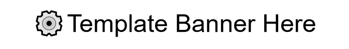

<!--- Heading --->
<div align="center">
  
  <h1>Template README</h1>
  <p>
    An awesome README template for your projects! 
  </p>
<h4>
    <a href="https://github.com/rpakishore/Template-Python/">View Demo</a>
  <span> · </span>
    <a href="https://github.com/rpakishore/Template-Python">Documentation</a>
  <span> · </span>
    <a href="https://github.com/rpakishore/Template-Python/issues/">Report Bug</a>
  <span> · </span>
    <a href="https://github.com/rpakishore/Template-Python/issues/">Request Feature</a>
  </h4>
</div>
<br />


<!-- Table of Contents -->
<h2>Table of Contents</h2>

- [1. About the Project](#1-about-the-project)
  - [1.1. Screenshots](#11-screenshots)
  - [1.2. Features](#12-features)
  - [1.3. Color Reference](#13-color-reference)
  - [1.4. Environment Variables](#14-environment-variables)
- [2. Getting Started](#2-getting-started)
  - [2.1. Prerequisites](#21-prerequisites)
  - [2.2. Dependencies](#22-dependencies)
  - [2.3. Installation](#23-installation)
    - [2.3.1. Production](#231-production)
    - [2.3.2. Development](#232-development)
- [3. Usage](#3-usage)
  - [3.1. Development](#31-development)
- [4. Modules](#4-modules)
  - [4.1. requests\_package.py](#41-requests_packagepy)
- [5. Roadmap](#5-roadmap)
- [6. FAQ](#6-faq)
- [7. License](#7-license)
- [8. Contact](#8-contact)
- [9. Acknowledgements](#9-acknowledgements)

<!-- About the Project -->
## 1. About the Project
<!-- Screenshots -->
### 1.1. Screenshots

<div align="center"> 
  
</div>

<!-- Features -->
### 1.2. Features

- Feature 1
- Feature 2
- Feature 3

<!-- Color Reference -->
### 1.3. Color Reference

| Color             | Hex                                                                |
| ----------------- | ------------------------------------------------------------------ |
| Primary Color |  #222831 |
| Secondary Color |  #393E46 |
| Accent Color |  #00ADB5 |
| Text Color |  #EEEEEE |

<!-- Env Variables -->
### 1.4. Environment Variables

To run this project, you will need to add the following environment variables to your .env file

`API_KEY`

`ANOTHER_API_KEY`

<!-- Getting Started -->
## 2. Getting Started

<!-- Prerequisites -->
### 2.1. Prerequisites

### 2.2. Dependencies

Create the virutual environment and install dependencies

```bash
python -m venv .venv

.venv\Scripts\activate.bat

pip install flit
```

<!-- Installation -->
### 2.3. Installation

#### 2.3.1. Production

Install with flit

```bash
  flit install --deps production
```

#### 2.3.2. Development

Install with flit

```bash
  flit install --pth-file
```

<!-- Usage -->
## 3. Usage

Use this space to tell a little more about your project and how it can be used. Show additional screenshots, code samples, demos or link to other resources.

```bash
  app --help
```

### 3.1. Development

1. Open the project directory in vscode
2. Update the app name under `pyproject.toml`
3. Change the folder name from `src\template_python` to `src\<app_name>`, and propate the changes to the subfolders.
4. Review the dependencies under `pyproject.toml` and remove as needed.
5. Remove unneeded dependencies from `src\<app_name>\`

## 4. Modules

### 4.1. requests_package.py

Includes frequently used requests packages, functions, classes and defaults
The following functions are defined in the `req` class

|Function Name| Purpose|
|-------------|--------|
|`randomize_header`|Randomize request headers by updating both referer and useragent|
|`change_useragent`|Change request useragent to random one|
|`change_referer`|Randomly set google.com as referer|
|`get_from_list`|Complete requests to a list of urls and return the list of responses|
|`get`|URL request with header randomization, timeout, proxy and retries builtin|
|`proxy_get_from_list`|Complete requests to a list of urls and return the list of responses using proxy ips|
|`proxy_get`|completes `get` request using proxies|
|`create_session`|Generate sessions object with adequate headers and adapters|

<!-- Roadmap -->
## 5. Roadmap

- [x] Set up a skeletal framework
- [ ] Todo 2

<!-- FAQ -->
## 6. FAQ

- Question 1
  - Answer 1

- Question 2
  - Answer 2

<!-- License -->
## 7. License

See LICENSE.txt for more information.

<!-- Contact -->
## 8. Contact

Arun Kishore - [@rpakishore](mailto:pypi@rpakishore.co.in)

Project Link: [https://github.com/rpakishore/Template-Python](https://github.com/rpakishore/Template-Python)

<!-- Acknowledgments -->
## 9. Acknowledgements

Use this section to mention useful resources and libraries that you have used in your projects.

- [Awesome README Template](https://github.com/Louis3797/awesome-readme-template/blob/main/README-WITHOUT-EMOJI.md)
- [Banner Maker](https://banner.godori.dev/)
- [Shields.io](https://shields.io/)
- [Carbon](https://carbon.now.sh/)